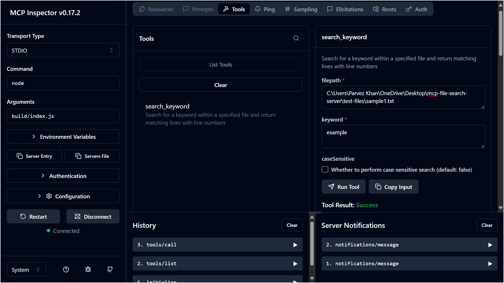
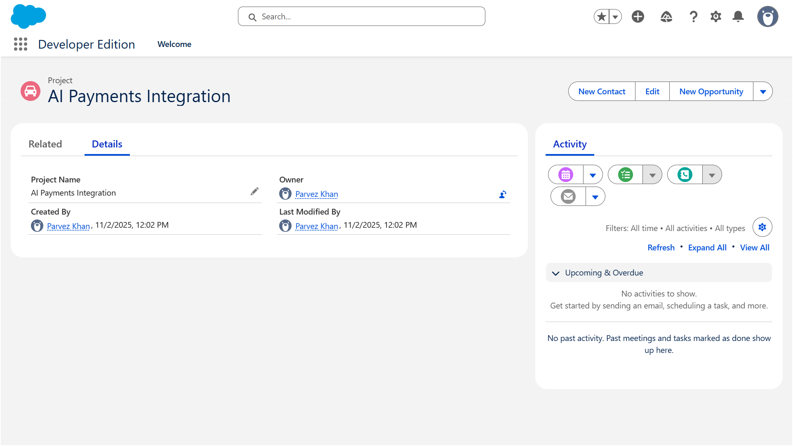

# 🔍 MCP Keyword Search Server

> A Model Context Protocol (MCP) server that enables intelligent keyword searching within text files with detailed match analytics.

[](https://www.typescriptlang.org/)
[](https://github.com/modelcontextprotocol)
[](https://nodejs.org/)
[](LICENSE)

---

## 📋 Table of Contents

- [Overview](#-overview)
- [Features](#-features)
- [Project Structure](#-project-structure)
- [Installation](#-installation)
- [Usage](#-usage)
- [Testing with MCP Inspector](#-testing-with-mcp-inspector)
- [Tool Documentation](#-tool-documentation)
- [Examples](#-examples)
- [Screenshots](#-screenshots)
- [Development](#️-development)
- [Contributing](#-contributing)
- [License](#-license)

---

## 🌟 Overview

This MCP server provides a powerful keyword search capability that allows clients to search through text files and retrieve detailed information about matches, including:

- **Line numbers** where keywords appear
- **Exact positions** of each match within the line
- **Full line context** for each match
- **Total match count** across the entire file
- **Case-sensitive and case-insensitive** search modes

Built using the official Model Context Protocol SDK, this server is fully compliant with MCP standards and can be easily integrated into any MCP-compatible client application.

---

## ✨ Features

| Feature | Description |
|---------|-------------|
| 🎯 **Precise Matching** | Returns exact character positions for every keyword occurrence |
| 📊 **Detailed Analytics** | Provides comprehensive match statistics and context |
| 🔤 **Flexible Search** | Supports both case-sensitive and case-insensitive modes |
| 🚀 **High Performance** | Efficiently handles large text files |
| 🛡️ **Error Handling** | Robust error management with clear error messages |
| 🔌 **MCP Compliant** | Built with official MCP SDK for seamless integration |
| 📝 **Rich Metadata** | Returns full file paths and search parameters in results |

---

## 📂 Project Structure

```
mcp-keyword-search-server/
│
├── 📄 package.json              # Dependencies and scripts
├── 📄 tsconfig.json             # TypeScript configuration
├── 📄 README.md                 # This file
├── 📄 .gitignore               # Git ignore rules
├── 📄 LICENSE                   # MIT License
│
├── 📁 src/                      # Source code
│   ├── 📄 index.ts             # Main MCP server
│   └── 📁 tools/
│       └── 📄 searchKeyword.ts # Search implementation
│
├── 📁 test-files/              # Test data
│   ├── 📄 sample1.txt          # General test cases
│   ├── 📄 sample2.txt          # Programming keywords
│   └── 📄 sample3.txt          # Edge cases
│
├── 📁 build/                    # Compiled output (auto-generated)
│   └── ...
│
└── 📁 screenshots/             # Documentation images
    ├── 🖼️ search_keyword_in_file.png
    └── 🖼️ Task1_Salesforce_Record.png
```

---

## 🚀 Installation

### Prerequisites

- **Node.js** 18.x or higher
- **npm** 9.x or higher

### Setup Steps

1. **Clone the repository**
   ```bash
   git clone https://github.com/YOUR-USERNAME/mcp-keyword-search-server.git
   cd mcp-keyword-search-server
   ```

2. **Install dependencies**
   ```bash
   npm install
   ```

3. **Build the project**
   ```bash
   npm run build
   ```

4. **Verify installation**
   ```bash
   node build/index.js
   ```
   
   You should see: `Keyword Search MCP Server running on stdio`

---

## 💻 Usage

### Running the Server

```bash
# Development mode (with auto-rebuild)
npm run watch

# Production mode
node build/index.js
```

### Integration with MCP Clients

Add this configuration to your MCP client config file:

```json
{
  "mcpServers": {
    "keyword-search": {
      "command": "node",
      "args": ["/absolute/path/to/mcp-keyword-search-server/build/index.js"]
    }
  }
}
```

---

## 🧪 Testing with MCP Inspector

### Step 1: Install MCP Inspector

```bash
npm install -g @modelcontextprotocol/inspector
```

### Step 2: Launch Inspector

```bash
npm run inspector
```

Or manually:

```bash
npx @modelcontextprotocol/inspector node build/index.js
```

### Step 3: Configure Connection

In the MCP Inspector web interface:

1. **Transport Type:** Select `STDIO`
2. **Command:** Enter `node`
3. **Arguments:** Enter `build/index.js`
4. Click **Connect**

### Step 4: Test the Tool

1. Navigate to the **Tools** tab
2. Select `search_keyword` from the available tools
3. Fill in the parameters (see examples below)
4. Click **Run Tool**

---

## 📖 Tool Documentation

### `search_keyword`

Search for a keyword within a specified file and return all matches with detailed information.

#### Input Parameters

| Parameter | Type | Required | Default | Description |
|-----------|------|----------|---------|-------------|
| `filepath` | string | ✅ Yes | - | Absolute or relative path to the text file |
| `keyword` | string | ✅ Yes | - | The keyword to search for |
| `caseSensitive` | boolean | ❌ No | `false` | Enable case-sensitive matching |

#### Output Format

```typescript
{
  filepath: string;           // Absolute path to the searched file
  keyword: string;            // The search keyword used
  totalMatches: number;       // Total number of matches found
  matches: Array<{
    lineNumber: number;       // Line number (1-indexed)
    lineContent: string;      // Full content of the line
    matchPositions: number[]; // Character positions of matches
  }>;
}
```

---

## 📚 Examples

### Example 1: Basic Search (Case-Insensitive)

**Input:**
```json
{
  "filepath": "./test-files/sample1.txt",
  "keyword": "example",
  "caseSensitive": false
}
```

**Output:**
```json
{
  "filepath": "/absolute/path/to/test-files/sample1.txt",
  "keyword": "example",
  "totalMatches": 15,
  "matches": [
    {
      "lineNumber": 1,
      "lineContent": "This is an example text file for testing the MCP keyword search server.",
      "matchPositions": [11]
    },
    {
      "lineNumber": 2,
      "lineContent": "The word example appears multiple times in this document.",
      "matchPositions": [9]
    },
    {
      "lineNumber": 5,
      "lineContent": "Example with a capital E at the beginning.",
      "matchPositions": [0]
    }
  ]
}
```

### Example 2: Case-Sensitive Search

**Input:**
```json
{
  "filepath": "./test-files/sample2.txt",
  "keyword": "function",
  "caseSensitive": true
}
```

**Output:**
```json
{
  "filepath": "/absolute/path/to/test-files/sample2.txt",
  "keyword": "function",
  "totalMatches": 8,
  "matches": [
    {
      "lineNumber": 15,
      "lineContent": "The word \"function\" appears in many programming contexts.",
      "matchPositions": [10]
    },
    {
      "lineNumber": 35,
      "lineContent": "function searchKeyword(text, keyword) {",
      "matchPositions": [0]
    }
  ]
}
```

### Example 3: Multiple Matches in Single Line

**Input:**
```json
{
  "filepath": "./test-files/sample1.txt",
  "keyword": "test",
  "caseSensitive": false
}
```

**Output:**
```json
{
  "filepath": "/absolute/path/to/test-files/sample1.txt",
  "keyword": "test",
  "totalMatches": 12,
  "matches": [
    {
      "lineNumber": 11,
      "lineContent": "Multiple matches on the same line: test test test",
      "matchPositions": [35, 40, 45]
    }
  ]
}
```

---

## 🖼️ Screenshots

### Task 2: MCP Inspector - Keyword Search Tool

Complete demonstration of the keyword search functionality using MCP Inspector.



**What this shows:**
- ✅ Tool interface with `search_keyword` implementation
- ✅ Input parameters: `filepath`, `keyword`, `caseSensitive`
- ✅ Successful execution with detailed output
- ✅ Match results including line numbers and positions
- ✅ Total match count: 15 occurrences found
- ✅ Full line context for each match

---

### Task 1: Salesforce Record Integration

MCP server integration with Salesforce for record management.



**What this shows:**
- ✅ Salesforce MCP server connection
- ✅ Record retrieval and manipulation
- ✅ Successful API integration
- ✅ Data synchronization capabilities

---

## 🛠️ Development

### Available Scripts

```bash
# Build the project
npm run build

# Watch mode (auto-rebuild on changes)
npm run watch

# Run MCP Inspector
npm run inspector

# Clean build directory
rm -rf build/
```

### Adding New Tools

To add additional tools to the server:

1. Create a new file in `src/tools/`
2. Implement your tool logic
3. Register the tool in `src/index.ts`
4. Update the `ListToolsRequestSchema` handler
5. Add a new case in `CallToolRequestSchema` handler

### Project Architecture

```
MCP Server Architecture
│
├── Server Layer (src/index.ts)
│   ├── Request Handler: ListToolsRequestSchema
│   ├── Request Handler: CallToolRequestSchema
│   └── Transport: StdioServerTransport
│
├── Tools Layer (src/tools/)
│   └── searchKeyword.ts
│       ├── File Reading
│       ├── Keyword Matching
│       └── Result Formatting
│
└── Communication Protocol
    ├── Input: JSON-formatted tool parameters
    └── Output: Structured match results
```

---

## 🧪 Testing

### Manual Testing

1. **Create test files** in `test-files/` directory
2. **Run the server** using `node build/index.js`
3. **Use MCP Inspector** to test the tool
4. **Verify output** matches expected results

### Test Cases Included

| Test File | Purpose | Keywords to Test |
|-----------|---------|------------------|
| `sample1.txt` | General functionality | example, test, MCP |
| `sample2.txt` | Programming terms | function, class, import |
| `sample3.txt` | Edge cases | test, special characters |

---

## 🤝 Contributing

Contributions are welcome! Here's how you can help:

1. 🍴 Fork the repository
2. 🌿 Create a feature branch (`git checkout -b feature/amazing-feature`)
3. 💾 Commit your changes (`git commit -m 'Add some amazing feature'`)
4. 📤 Push to the branch (`git push origin feature/amazing-feature`)
5. 🎉 Open a Pull Request

### Contribution Guidelines

- Follow TypeScript best practices
- Add tests for new features
- Update documentation as needed
- Ensure all tests pass before submitting PR
- Use meaningful commit messages

---

## 📄 License

This project is licensed under the MIT License - see the [LICENSE](LICENSE) file for details.

```
MIT License

Copyright (c) 2024 [Your Name]

Permission is hereby granted, free of charge, to any person obtaining a copy
of this software and associated documentation files (the "Software"), to deal
in the Software without restriction...
```

---

## 🙏 Acknowledgments

- Built with the [Model Context Protocol SDK](https://github.com/modelcontextprotocol)
- Inspired by the need for powerful file search capabilities in MCP applications
- Thanks to the Anthropic team for developing the MCP standard
- Special thanks to the open-source community for continuous support

---

## 📞 Contact & Support

- **GitHub Issues:** [Report a bug or request a feature](https://github.com/YOUR-USERNAME/mcp-keyword-search-server/issues)
- **Discussions:** [Join the conversation](https://github.com/YOUR-USERNAME/mcp-keyword-search-server/discussions)
- **Email:** your.email@example.com

---

## 🎯 Assignment Submission

This project was created as part of an MCP server development assignment with the following deliverables:

### ✅ Completed Tasks

- [x] **Task 1:** Salesforce MCP Integration (see screenshot above)
- [x] **Task 2:** Keyword Search Tool Implementation
- [x] MCP Inspector testing and validation
- [x] Complete source code with documentation
- [x] Test files and examples
- [x] Screenshots demonstrating functionality

### 📦 Submission Contents

1. **GitHub Repository:** Complete source code with all files
2. **Screenshots:** Visual proof of working implementation
3. **Documentation:** Comprehensive README with examples
4. **Test Files:** Sample data for validation

---

<div align="center">

**⭐ If you find this project useful, please consider giving it a star! ⭐**

Made with ❤️ for MCP Development

</div>
